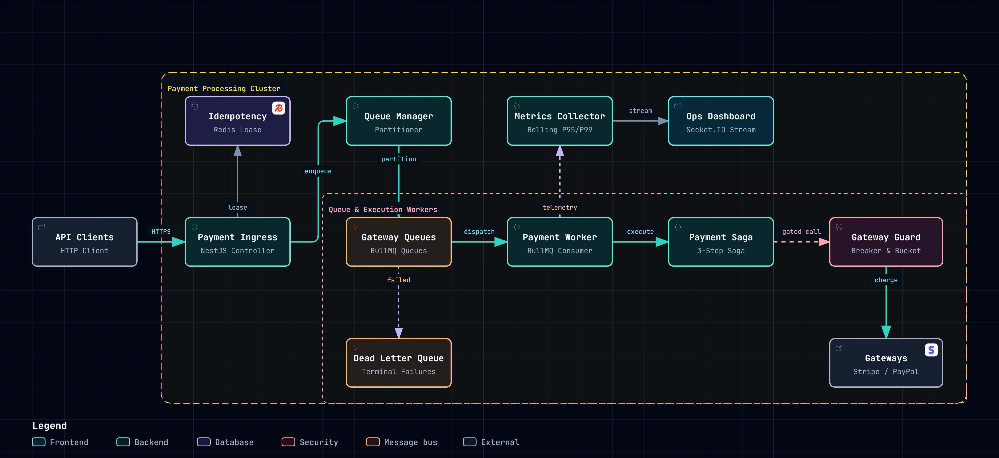
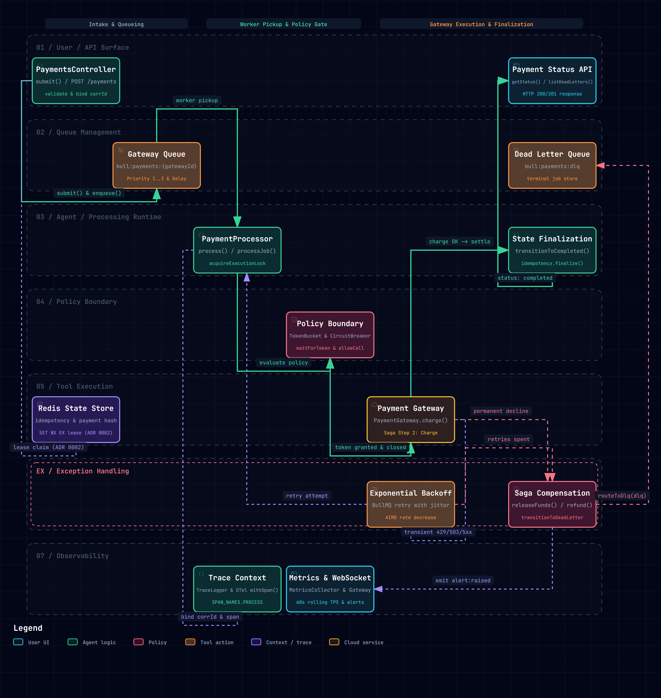

# Distributed Payment Processing Queue System

A production-grade, distributed, fault-tolerant payment processing queue system built with **NestJS**, **BullMQ**, and **Redis**. Designed to handle high-throughput financial transactions with per-gateway queue isolation, atomic idempotency guarantees, adaptive rate limiting, circuit breaking, automated saga compensation, and end-to-end observability.

---

## Architecture Overview

The system decouples synchronous HTTP payment ingress from asynchronous gateway settlement, providing resilient execution across heterogeneous payment providers (e.g., Stripe, PayPal).



### Interactive Workflow Diagram

Explore the distributed processing flow with live theme switching, trace animations, and guided operational chapters in the standalone HTML viewer:
- **[Interactive Workflow Viewer (Archify Showcase)](docs/architecture/payment-processing-workflow.html)**
- **[Workflow Specification](docs/architecture/payment-processing.workflow.json)**



---

## Core Architectural Guarantees

### 1. Per-Gateway Queue Isolation & Priority Scheduling (ADR 0001)
- **Failure Domain Isolation:** Each external payment gateway operates on an isolated BullMQ queue (`bull:payments:{gatewayId}`). A slowdown, degradation, or outage on one gateway never blocks or starves another.
- **Priority Tiers:** Payment jobs are enqueued with strict priority weights (`1: high`, `2: normal`, `3: low`), ensuring critical checkout transactions preempt batch or low-priority recurring payments.
- **Dynamic Worker Scaling:** Worker pools scale dynamically per gateway based on queue depth and processing backlog (`QueueManager.ensureGateway()`).

### 2. Two-Phase Atomic Idempotency (ADR 0002)
- **Crash-Safe Leases:** Payments claim an atomic Redis `SET NX EX` lease lock upon intake, preventing concurrent double-charges across worker replicas.
- **Execution State Cache:** Once finalized, payment results are cached with a 24-hour TTL. Duplicate client requests receive immediate, consistent responses without re-executing gateway charges.
- **Immutable Financial Audit Log:** Every phase transition (`pending` &rarr; `processing` &rarr; `completed` / `failed` / `dead_letter`) is recorded in an append-only Redis audit list (`audit:payment:{id}`).

### 3. Resilience Boundary & Adaptive AIMD Rate Limiting (ADR 0003)
- **Adaptive Token Bucket:** Flow control adapts dynamically via **Additive Increase / Multiplicative Decrease (AIMD)**. When downstream gateways respond with HTTP `429 Too Many Requests` or `503 Service Unavailable`, capacity scales down multiplicatively ($rate \times 0.7$) and recovers additively upon consecutive successful calls.
- **Three-State Circuit Breaker:** Sliding-window error sampler transitions through `CLOSED`, `OPEN`, and `HALF_OPEN`. When error rates exceed threshold (default: 50%), the breaker trips to `OPEN`, immediately fast-failing calls to protect provider quotas and system stability.
- **Exponential Backoff with Full Jitter:** Retries for transient failures are scheduled with exponential delay ($delay \times 2^{attempt}$) randomized with full jitter to eliminate thundering herds.

### 4. 3-Step Saga with Automated Compensation
The execution engine follows an explicit, reversible saga workflow:
1. **Reserve Funds:** Issues an internal allocation token (`res_{paymentId}_{timestamp}`) and records reservation state.
2. **Authorize & Charge:** Evaluates policy boundary gates (token bucket & circuit breaker) before invoking external payment gateway endpoints.
3. **Settle & Ledger:** Records double-entry financial journal entries in the append-only `SettlementLedger` and finalizes state to `COMPLETED`.
- **Compensation & Rollback:** If settlement fails after a successful charge, automated compensation triggers a gateway refund and releases internal reservations. If compensation fails, critical alarms are dispatched immediately.

### 5. Dead-Letter Queue (DLQ) & Operator Recovery
- **Error Taxonomy:** Strict partitioning between *transient* errors (rate limits, network timeouts, 5xx responses &rarr; retryable) and *permanent* declines (invalid card, fraud rejection, expired credentials &rarr; non-retryable).
- **Terminal Queue (`bull:payments:dlq`):** Permanent declines bypass retry loops and route straight to DLQ. Jobs exhausting their maximum retry budget are safely moved to DLQ with error context and stack traces.
- **Operator Replay API:** Dedicated endpoints allow operational inspection and manual replay of dead-lettered jobs once downstream issues are resolved.

### 6. Real-Time Observability & OpenTelemetry (ADR 0004)
- **60-Second Rolling Window Metrics:** `MetricsCollector` tracks live throughput (TPS), error percentages, queue depths (waiting + prioritized), and P95/P99 latency histograms without expensive Redis history queries.
- **WebSocket Streaming:** Operates a live Socket.IO gateway broadcasting real-time metric snapshots, lifecycle events (`payment.completed`, `job.failed`), and threshold alerts (`alert:raised`).
- **Distributed Tracing:** Distributed `CorrelationService` propagates `X-Correlation-Id` across HTTP headers, BullMQ job payloads, and child OpenTelemetry spans (`payment.process`, `payment.reserve`, `payment.charge`, `payment.settle`).

---

## Quick Start

### Prerequisites
- [Bun](https://bun.sh/) v1.2+ (or Node.js v20+)
- [Docker](https://www.docker.com/) & Docker Compose (for local Redis 7.4+)

### 1. Clone & Install Dependencies
```bash
git clone https://github.com/your-org/queue-system.git
cd queue-system
bun install
```

### 2. Start Redis
```bash
docker compose up -d redis
```

### 3. Run Development Server
```bash
# Start API & workers with live-reload
bun run start:dev
```
The server will start on `http://localhost:3000` with WebSocket gateway enabled.

### 4. Run Test Suite
```bash
# Unit & integration tests (Vitest)
bun test

# Test coverage report
bun run test:cov

# End-to-end validation tests
bun run test:e2e
```

---

## API Documentation (Swagger / OpenAPI)

The application provides interactive OpenAPI 3.0 documentation powered by Swagger UI:

- **Interactive Swagger UI:** [http://localhost:3000/docs](http://localhost:3000/docs)
- **OpenAPI 3.0 JSON Specification:** [http://localhost:3000/docs-json](http://localhost:3000/docs-json)

All endpoints include full schema definitions, request/response payload models, field-level descriptions, validation constraints, enum definitions, example payloads, and optional correlation tracking headers (`X-Correlation-Id`).

---

## API Reference

### 1. Payments API

#### Submit Payment (Immediate)
```http
POST /payments
Content-Type: application/json
X-Correlation-Id: corr_987654321

{
  "id": "pay_live_001",
  "amount": 5000,
  "currency": "USD",
  "customerId": "cust_12345",
  "gatewayId": "stripe",
  "priority": "high",
  "maxRetries": 3,
  "metadata": { "orderId": "ord_999" }
}
```
**Response (`201 Created` - Newly Enqueued):**
```json
{
  "id": "pay_live_001",
  "status": "queued"
}
```
**Response (`200 OK` - Idempotent Replay):**
```json
{
  "id": "pay_live_001",
  "status": "completed",
  "replayed": true,
  "payment": {
    "id": "pay_live_001",
    "amount": 5000,
    "currency": "USD",
    "customerId": "cust_12345",
    "gatewayId": "stripe",
    "priority": "high",
    "maxRetries": 3,
    "metadata": { "orderId": "ord_999" },
    "createdAt": "2026-09-10T12:00:00.000Z",
    "status": "completed",
    "retryCount": 0,
    "sagaState": "settled",
    "history": [
      { "phase": "reserve", "event": "ok", "at": "2026-09-10T12:00:00.100Z" },
      { "phase": "charge", "event": "ok", "at": "2026-09-10T12:00:00.250Z" },
      { "phase": "settle", "event": "ok", "at": "2026-09-10T12:00:00.300Z" }
    ],
    "transactionId": "tx_stripe_abc123"
  }
}
```

#### Schedule Payment (Future-Dated or Delayed)
```http
POST /payments/scheduled
Content-Type: application/json
X-Correlation-Id: corr_987654321

{
  "id": "pay_sched_001",
  "amount": 10000,
  "currency": "USD",
  "customerId": "cust_12345",
  "gatewayId": "stripe",
  "delayMs": 10000
}
```
**Response (`201 Created`):**
```json
{
  "id": "pay_sched_001",
  "status": "queued",
  "scheduledFor": "2026-09-10T12:00:10.000Z"
}
```

#### Get Payment Status & Audit Trail
```http
GET /payments/pay_live_001
```
**Response (`200 OK`):**
```json
{
  "id": "pay_live_001",
  "amount": 5000,
  "currency": "USD",
  "customerId": "cust_12345",
  "gatewayId": "stripe",
  "priority": "high",
  "maxRetries": 3,
  "metadata": { "orderId": "ord_999" },
  "createdAt": "2026-09-10T12:00:00.000Z",
  "status": "completed",
  "retryCount": 1,
  "sagaState": "settled",
  "history": [
    { "phase": "reserve", "event": "ok", "at": "2026-09-10T12:00:00.050Z" },
    { "phase": "charge", "event": "ok", "at": "2026-09-10T12:00:00.200Z" },
    { "phase": "settle", "event": "ok", "at": "2026-09-10T12:00:00.250Z" }
  ],
  "transactionId": "tx_stripe_abc123"
}
```

---

### 2. Dead-Letter Queue (DLQ) Management

#### Inspect Dead-Letter Queue Entries
```http
GET /queues/dlq
GET /queues/dlq?gatewayId=stripe
```
**Response (`200 OK`):**
```json
{
  "count": 1,
  "entries": [
    {
      "paymentId": "pay_failed_001",
      "reason": "Retries exhausted (3/3): gateway timeout",
      "deadLetteredAt": "2026-09-10T12:05:00.000Z",
      "correlationId": "corr_987654321",
      "payment": {
        "id": "pay_failed_001",
        "amount": 5000,
        "currency": "USD",
        "customerId": "cust_12345",
        "gatewayId": "stripe",
        "status": "dead_letter"
      }
    }
  ]
}
```

---

### 3. Real-Time Metrics & Telemetry

#### Operational Snapshot
```http
GET /queues/metrics
```
**Response (`200 OK`):**
```json
{
  "timestamp": "2026-09-10T12:00:00.000Z",
  "windowSeconds": 60,
  "tps": 142.5,
  "errorRate": 0.012,
  "attempts": {
    "ok": 120,
    "failed": 2,
    "total": 122
  },
  "p95Ms": 180,
  "p99Ms": 350,
  "queueDepths": [
    { "gatewayId": "stripe", "waiting": 12, "active": 4, "delayed": 2, "failed": 0 },
    { "gatewayId": "paypal", "waiting": 0, "active": 1, "delayed": 0, "failed": 0 }
  ],
  "alerts": []
}
```

#### Health Check
```http
GET /
```
**Response (`200 OK`):**
```json
{
  "name": "queue-system",
  "status": "ok"
}
```

#### WebSocket Stream (`ws://localhost:3000`)
Connect via Socket.IO client:
```javascript
import { io } from 'socket.io-client';
const socket = io('http://localhost:3000');

socket.on('metrics:snapshot', (snapshot) => {
  console.log('Live Snapshot:', snapshot);
});

socket.on('payment:event', (event) => {
  console.log('Payment Event:', event);
});

socket.on('alert:raised', (alert) => {
  console.error('CRITICAL OPERATIONAL ALERT:', alert);
});
```

---

## Production Deployment & Operations

For complete deployment architectures, Kubernetes manifests, and operations runbooks, refer to:
- **[Deployment & Operations Guide (docs/deployment.md)](docs/deployment.md)**
- **[Architecture Discussion & Scaling Guide (docs/architecture-discussion.md)](docs/architecture-discussion.md)**

### Production Highlights
- **Docker Compose:** Fully containerized multi-container stack (`docker compose up -d --build`).
- **Kubernetes Deployment:** Complete production manifests located in [`k8s/`](k8s/):
  - `k8s/deployment.yaml` — Rolling updates with zero downtime (`maxSurge: 1, maxUnavailable: 0`).
  - `k8s/hpa.yaml` — Horizontal Pod Autoscaler scaling from 3 to 20 replicas based on CPU & queue depth.
  - `k8s/configmap.yaml` & `k8s/secret.yaml` — Externalized configuration and credentials.
- **Graceful Draining:** On `SIGTERM`, ingress pools remove the terminating pod while NestJS shutdown hooks (`QueueManager.onApplicationShutdown()`) wait up to 60s for in-flight gateway transactions to settle cleanly before exit.

### Key Environment Variables

| Variable | Default | Description |
| :--- | :--- | :--- |
| `PORT` | `3000` | HTTP and WebSocket port. |
| `NODE_ENV` | `production` | Node environment mode. |
| `REDIS_URL` | `""` | Complete Redis connection string (takes precedence). |
| `REDIS_HOST` | `127.0.0.1` | Redis hostname. |
| `REDIS_PORT` | `6379` | Redis port. |
| `QUEUE_WORKER_POOL_SIZE` | `2` | Default worker concurrency per gateway. |
| `QUEUE_BACKOFF_BASE_MS` | `500` | Exponential retry base delay. |
| `QUEUE_BACKOFF_JITTER` | `30` | Exponential retry jitter percentage. |
| `IDEMPOTENCY_LEASE_TTL_SECONDS` | `600` | Crash-safe lock lease TTL for in-flight jobs (10m). |
| `RATE_LIMIT_NOMINAL_RPS` | `20` | Nominal tokens per second refill rate. |
| `CIRCUIT_BREAKER_WINDOW_MS` | `30000` | Sliding error window for circuit breaker (30s). |
| `CIRCUIT_BREAKER_FAILURE_THRESHOLD`| `0.5` | Failure ratio threshold (50%) to trip breaker OPEN. |
| `OTEL_EXPORTER_OTLP_ENDPOINT` | `""` | OpenTelemetry OTLP HTTP collector endpoint. |

---

## Architectural & System Design Q&A

Comprehensive architectural analyses and technical trade-offs answering core system design questions are documented in **[`docs/architecture-qa.md`](docs/architecture-qa.md)**:

| # | Question | Core Rationale & Mechanism | Routing |
| :-: | :--- | :--- | :-: |
| 1 | **Why BullMQ vs other queue systems?** | Native numeric priority scheduling (`1: high`, `2: normal`, `3: low`), arbitrary delay scheduling (`delayMs`), and shared Redis operational footprint—handling 50K–500K payments/hr at $<2\%$ capacity without Kafka/RabbitMQ broker overhead. | [Read Analysis &rarr;](docs/architecture-qa.md#1-why-bullmq-vs-other-queue-systems) |
| 2 | **How to prevent duplicate processing?** | Two-phase Redis idempotency (`SET NX EX` lease lock + 24h cache), BullMQ `jobId` deduplication across states, worker-level execution locks, and downstream gateway idempotency headers. | [Read Analysis &rarr;](docs/architecture-qa.md#2-how-to-prevent-duplicate-processing) |
| 3 | **Database vs Redis for state storage** | Sub-millisecond latency and native TTLs in Redis for hot-path transactional queues/leases vs. sharded relational SQL (e.g., PostgreSQL) for long-term ACID compliance, double-entry ledgers, and cold WORM archiving. | [Read Analysis &rarr;](docs/architecture-qa.md#3-database-vs-redis-for-state-storage) |
| 4 | **Microservices vs monolithic approach** | Modular Monolith with zero-RPC in-process saga execution (`Reserve -> Guard -> Charge -> Settle`) and clean domain seams (`GatewayGuard`, `QueueManager`), horizontally scaled via Kubernetes with clean path to role-split deployments. | [Read Analysis &rarr;](docs/architecture-qa.md#4-microservices-vs-monolithic-approach) |
| 5 | **Event sourcing considerations** | Current state-based design with append-only audit trail and ledger vs. pure event sourcing; trade-offs in optimistic concurrency versioning, projection read latency, and schema evolution. | [Read Analysis &rarr;](docs/architecture-qa.md#5-event-sourcing-considerations) |

### Key Discussion Points Summary

#### 1. [Why BullMQ vs other queue systems?](docs/architecture-qa.md#1-why-bullmq-vs-other-queue-systems)
- **Failure Domain Isolation (ADR 0001):** Dedicated per-gateway queues (`bull:payments:{gatewayId}`) prevent slow or failing providers from starving healthy gateways.
- **Native Priority & Delays:** Numeric priority scheduling and arbitrary delayed execution operate inside BullMQ without creating $N \times 3$ physical queues.
- **Operational Simplicity:** Reuses the existing Redis 7+ cluster already backing idempotency and locks, eliminating ZooKeeper, KRaft, or Erlang brokers.
- &rarr; *Full breakdown, comparison matrix (BullMQ vs Kafka vs RabbitMQ vs SQS), and metrics:* **[Read Answer in `docs/architecture-qa.md`](docs/architecture-qa.md#1-why-bullmq-vs-other-queue-systems)**

#### 2. [How to prevent duplicate processing?](docs/architecture-qa.md#2-how-to-prevent-duplicate-processing)
- **Two-Phase Idempotency (ADR 0002):** Atomic `SET idempotency:payment:{id} ... EX 600 NX` grants an exclusive `PROCESSING` lease during ingress; finalized state is cached with 24h TTL.
- **BullMQ `jobId` Deduplication:** Native deduplication ensures identical payment IDs cannot be queued simultaneously.
- **Worker Execution Lock:** Workers atomically acquire `lock:payment:process:{paymentId}` before saga execution to eliminate concurrent processing across worker replicas.
- &rarr; *Full breakdown, sequence flow, and edge-case handling:* **[Read Answer in `docs/architecture-qa.md`](docs/architecture-qa.md#2-how-to-prevent-duplicate-processing)**

#### 3. [Database vs Redis for state storage](docs/architecture-qa.md#3-database-vs-redis-for-state-storage)
- **Hot-Path Redis Performance:** Sub-millisecond reads/writes, atomic lease acquisition, and automatic TTL expiration without background vacuum crons.
- **Relational SQL for System of Record:** Permanent storage, strict ACID double-entry settlement ledgers, and partitioned monthly audit tables (`audit_YYYY_MM`).
- **Sharding & Saga Design:** Customer-sharded SQL database with transaction-free sagas (self-compensating without 2PC).
- &rarr; *Full breakdown, trade-off matrix, and sharding architecture:* **[Read Answer in `docs/architecture-qa.md`](docs/architecture-qa.md#3-database-vs-redis-for-state-storage)**

#### 4. [Microservices vs monolithic approach](docs/architecture-qa.md#4-microservices-vs-monolithic-approach)
- **Zero RPC Latency in Financial Hot Path:** In-process saga transitions eliminate serialization overhead and partial network failure modes.
- **Clean Seams (ADR 0005):** Strict separation between `QueueManager` (lifecycle), `GatewayGuard` (resilience), and `PaymentSagaService` (business logic).
- **Horizontal Scaling & Role Splitting:** Stateless application scales horizontally from 3 to 20 pods (`k8s/hpa.yaml`), with a clean evolution to `--role=api` and `--role=worker` container profiles.
- &rarr; *Full breakdown, module boundaries, and decomposition roadmap:* **[Read Answer in `docs/architecture-qa.md`](docs/architecture-qa.md#4-microservices-vs-monolithic-approach)**

#### 5. [Event sourcing considerations](docs/architecture-qa.md#5-event-sourcing-considerations)
- **Current Append-Only Foundation:** Implements append-only audit lists (`audit:payment:{id}`) and double-entry settlement logs (`ledger:settlements`).
- **Pure Event Sourcing Trade-Offs:** Explores non-repudiation and time-travel benefits against optimistic concurrency collisions (`expectedVersion`), projection read latency on `GET /payments/:id`, and event schema versioning (upcasting).
- &rarr; *Full breakdown, architecture diagram, and trade-off comparison:* **[Read Answer in `docs/architecture-qa.md`](docs/architecture-qa.md#5-event-sourcing-considerations)**

---

## Architectural Deep-Dives & Further Reading

Detailed design records and engineering analyses are maintained in `docs/`:
- **[Architectural & System Design Q&A (`docs/architecture-qa.md`)](docs/architecture-qa.md)** — In-depth answers to core design questions (BullMQ trade-offs, duplicate prevention, Redis vs SQL, monolith vs microservices, event sourcing).
- **[Architecture Discussion (`docs/architecture-discussion.md`)](docs/architecture-discussion.md)** — Scaling from 50K to 500K payments/hour, database sharding strategies, multi-region disaster recovery (RPO/RTO), and PCI-DSS compliance boundaries.
- **[Deployment Guide (`docs/deployment.md`)](docs/deployment.md)** — Local Docker Compose, Kubernetes manifests, zero-downtime rolling upgrades, and monitoring runbooks.
- **[ADR 0001: Per-Gateway Queue Isolation (`docs/adr/0001-per-gateway-queues.md`)](docs/adr/0001-per-gateway-queues.md)** — Rationale for partitioned BullMQ namespaces.
- **[ADR 0002: Two-Phase Redis Idempotency (`docs/adr/0002-two-phase-idempotency.md`)](docs/adr/0002-two-phase-idempotency.md)** — Atomic lease locks and deduplication design.
- **[ADR 0003: Adaptive AIMD Rate Limiting (`docs/adr/0003-adaptive-token-bucket-rate-limiting.md`)](docs/adr/0003-adaptive-token-bucket-rate-limiting.md)** — Flow control algorithms under gateway pressure.
- **[ADR 0004: Rolling In-Memory Metrics (`docs/adr/0004-rolling-window-metrics-and-websockets.md`)](docs/adr/0004-rolling-window-metrics-and-websockets.md)** — Zero-overhead operational latency histograms.
- **[ADR 0005: Gateway Guard Seam (`docs/adr/0005-gateway-guard-seam.md`)](docs/adr/0005-gateway-guard-seam.md)** — Gating and outcome classification boundary.

---

## License

This project is licensed under the MIT License.
